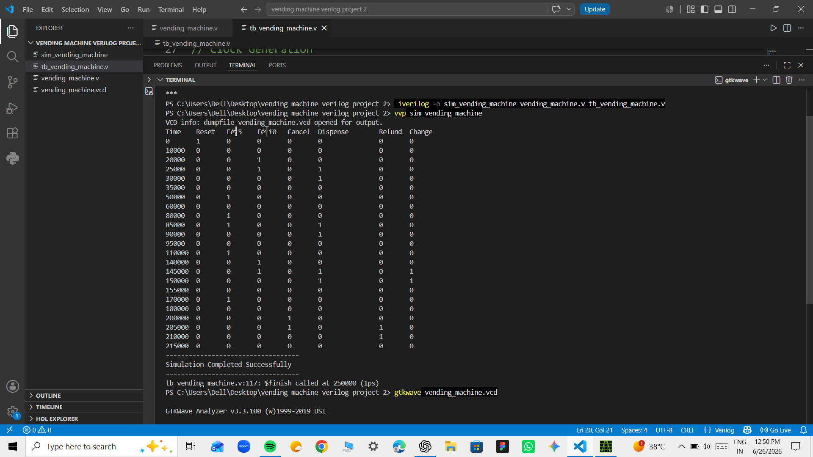
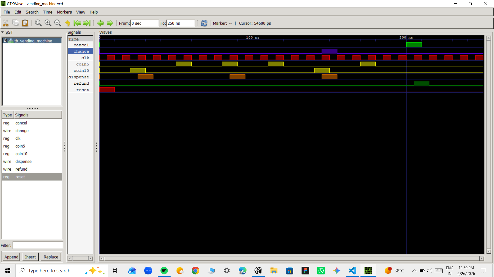

# Enhanced FSM-Based Smart Vending Machine Controller using Verilog HDL

## 📌 Project Overview

This project implements an **Enhanced Smart Vending Machine Controller** using **Verilog HDL** based on the **Moore Finite State Machine (FSM)** architecture.

The vending machine accepts ₹5 and ₹10 coins and provides additional real-world functionalities such as **transaction cancellation**, **refund**, and **change return**. The design has been functionally verified using a dedicated Verilog testbench and simulated with **Icarus Verilog** and **GTKWave**.

---

## 🚀 Features

- Moore FSM-based design
- Accepts ₹5 and ₹10 coins
- Product dispensing functionality
- Cancel transaction feature
- Refund mechanism
- Automatic ₹5 change return for excess payment
- Reset functionality
- Complete Verilog testbench
- Functional verification using GTKWave

---

## 🛠️ Tools Used

- Verilog HDL
- Icarus Verilog
- GTKWave
- Visual Studio Code
- Git & GitHub

---

## 📂 Project Structure

```
Enhanced-FSM-Vending-Machine-Verilog
│
├── vending_machine.v
├── tb_vending_machine.v
├── README.md
│
└── images
    ├── waveform.png
    └── output.png
```

---

## ⚙️ FSM States

| State | Description |
|--------|-------------|
| S0 | Idle state (Waiting for coins) |
| S5 | ₹5 inserted |
| DISPENSE | Dispenses the product |
| CHANGE | Dispenses product and returns ₹5 change |
| REFUND | Returns inserted money after cancel request |

---

## 🧪 Test Cases Verified

✔ Reset Operation

✔ ₹10 Coin → Product Dispensed

✔ ₹5 + ₹5 → Product Dispensed

✔ ₹5 + ₹10 → Product Dispensed + ₹5 Change

✔ ₹5 + Cancel → Refund

✔ Idle State Verification

---

## 📚 Learning Outcomes

Through this project, I gained practical experience in digital design and Verilog HDL by implementing and verifying a Finite State Machine (FSM)-based controller. Key learning outcomes include:

- Designed and implemented a **Moore Finite State Machine (FSM)** in Verilog HDL.
- Applied **sequential logic** concepts using state registers and next-state logic.
- Learned to model real-world behavior such as **product dispensing, transaction cancellation, refund, and change return**.
- Developed a comprehensive **Verilog testbench** to verify multiple transaction scenarios.
- Performed functional simulation using **Icarus Verilog** and analyzed waveforms with **GTKWave**.
- Improved debugging skills by identifying and resolving FSM transition and output logic issues.
- Practiced writing clean, modular, and well-documented Verilog code.
- Gained hands-on experience with **Git and GitHub** for version control and project documentation.
- Strengthened understanding of the RTL design and verification workflow used in digital hardware development.

## ▶️ How to Run

### Compile

```bash
iverilog -o vending vending_machine.v tb_vending_machine.v
```

### Run Simulation

```bash
vvp vending
```

### View Waveform

```bash
gtkwave vending_machine.vcd
```

---

## 📸 Simulation Results

### Output



### GTKWave Waveform



---

## 📈 Future Enhancements

- Multiple product selection
- Inventory management
- Out-of-stock detection
- Seven-segment display interface
- FPGA implementation
- Datapath and Controller architecture

---

## 🎯 Key Concepts Covered

- Verilog HDL
- Moore Finite State Machine (FSM)
- Sequential Logic Design
- State Transition Diagram
- RTL Design
- Testbench Development
- Functional Simulation
- Digital System Verification
- Icarus Verilog
- GTKWave
- Git & GitHub

## 👩‍💻 Author

**Kashish Garg**

B.Tech | Electronics & VLSI Engineering

GitHub: https://github.com/kashishgargk123-star

---
